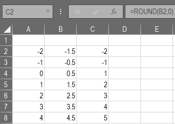

<!-- README.md is generated from README.Rmd. Please edit that file -->

```{r setup, include = FALSE}
knitr::opts_chunk$set(
  collapse = TRUE,
  comment = "#>",
  fig.path = "man/figures/README-",
  out.width = "100%"
)
```
# ExcelRound

You probably shouldn't use this unless you need to replicate something done in Excel.

```{r eval=FALSE}
devtools::install_github("mps9506/ExcelRound")
```

```{r}
# IEEE / IEC rounding: -2  0  0  2  2  4  4
round(.5 + -2:4)
```


```{r}
library(ExcelRound)
## Expect -2 -1 1 2 3 4 5
xl_round(.5 + -2:4)
```


```{r echo=FALSE, out.width = "30%"}

```

Note that this function adds a very small amount to `x` which scales with the number of digits to the left of the decimal point. It is possible that rounding might be incorrect above 1E15 or 1E-15. See https://stackoverflow.com/a/59933065/4488436 for details.


```{r}
devtools::test(reporter = "summary")
```

